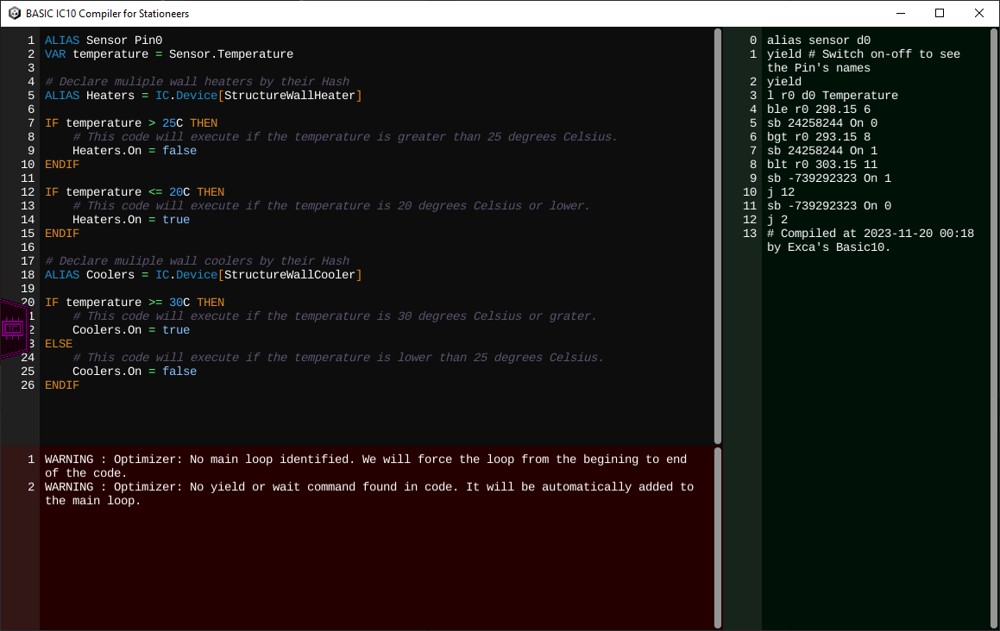
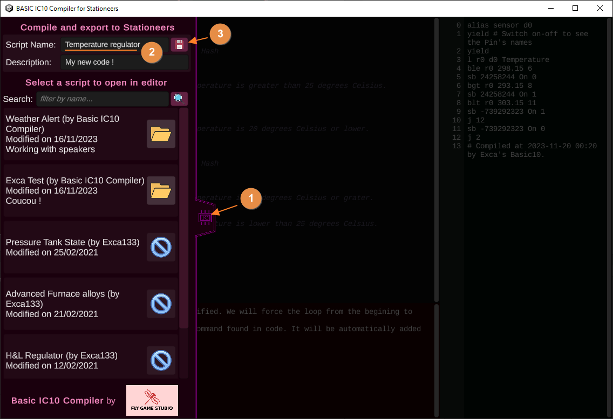

# Quick Start

Getting started with our BASIC IC10 Compiler for Stationeers is quick and straightforward. Here's a quick guide to jump into coding:

1. **Download and Launch:**
   - Copy the application folder to your preferred location (no installation is required).
   - Start the application by running `BASIC IC10 Compiler - Stationeers.exe`.

2. **Begin Coding:**
   - The application opens a resizable window with three panels:
     - *Top Left Panel:* This is your primary workspace for coding in BASIC.
     - *Right Panel:* It displays the automatically generated IC 10 MIPS code.
     - *Bottom Left Panel:* This area is dedicated to error and warning messages in case the application encounters issues with your code.

3. **Coding Workflow:**
   - Type your BASIC code directly within the application. Alternatively, you can write your code in your favorite text editor and then paste it into the application.
   - Click on the "IC" icon to open the left panel. Type a name for your program and save it, it will be added to your Stationeers Code Library.

## Code directly in the software


## Save you code to the Stationeers Library


# How to code in Basic

1. **Declare a Variable (equivalent to a register in MIPS)**

    To declare a variable in BASIC, use the `VAR` keyword followed by the variable name. For example:
    ```basic
    VAR temperature
    ```

    [More about Variables and declarations](Basic%20Language%20Reference.md#declarations)

    This creates a variable named temperature that can be used to store and manipulate values.
    ```basic
    VAR temperature
    temperature = 20 C   # 'C' means Celcius - the conversion is done automatically to Kelvin
    ```
    
    [More about Values assignation](Basic%20Language%20Reference.md#set-a-value)

    [More about Units like C, MPa, %, etc.](Basic%20Language%20Reference.md#units)


2. **Read a value from a device (equivalent to L in MIPS)**

    To read the temperature from a gas sensor, use the `ALIAS` command to associate the sensor with a variable. For instance:
    ```basic
    ALIAS gasSensor = IC.Pin[0]   # The sensor is set on Pin number 0 of the IC housing
    VAR temperature
    temperature = gasSensor.Temperature   # The 'Temperature' variable of the device is stored into the 'temperature' variable
    ```

    In this example, temperature will hold the temperature value read from the gas sensor on Pin0.

    [More about reading devices](Basic%20Language%20Reference.md#devices)


3. **Set a value on a device (equivalent to S in MIPS)**

    Use the `CONST` command to define a constant value, and then use it in a comparision statement to control a wall heater. For example:
    ```basic
    ALIAS gasSensor = IC.Pin[0]   # The sensor is set on Pin 0 of the IC housing
    ALIAS wallHeater = IC.Pin[1]  # and the Wall Heater on Pin 1
    
    CONST targetTemperature = 20 C  # The constant will be our goal temperature

    wallHeater.On = (gasSensor.Temperature < targetTemperature)   # in one line of code, we can read the temperature, compare it, then use the result to switch the wall heater 'On' variable to 0 or 1
    ```

    [More about Constant values](Basic%20Language%20Reference.md#constants)
    
    [More about Comparisions and other Calculations](Basic%20Language%20Reference.md#calculations)


4. **Structure a more complex code**

    The BASIC language can understand some more advanced structures, like `if-then-else` structures, `while` loops, etc.
    
    [More about Conditional Structures](Basic%20Language%20Reference.md#conditional-structures)

    You can also use many functions for calculation to write a more readable code.

    ```basic
    # In Basic
    var settingPump = (a + b) * abs(c)  # this line is easy to understand
    ```

    ```
    # In MIPS ... not as easy
    alias a r0
    alias b r1
    alias c r2
    alias sumAB r3
    alias absC r4
    alias settingPump r5
    add sumAB a b
    abs absC c
    mul settingPump sumAB absC
    ```

    [More about Functions](Basic%20Language%20Reference.md#functions)

# Language Documentation

For a more complete guide of the BASIC programming language and its capabilities, be sure to check out our full documentation here: [Online documentation](Basic%20Language%20Reference.md)
