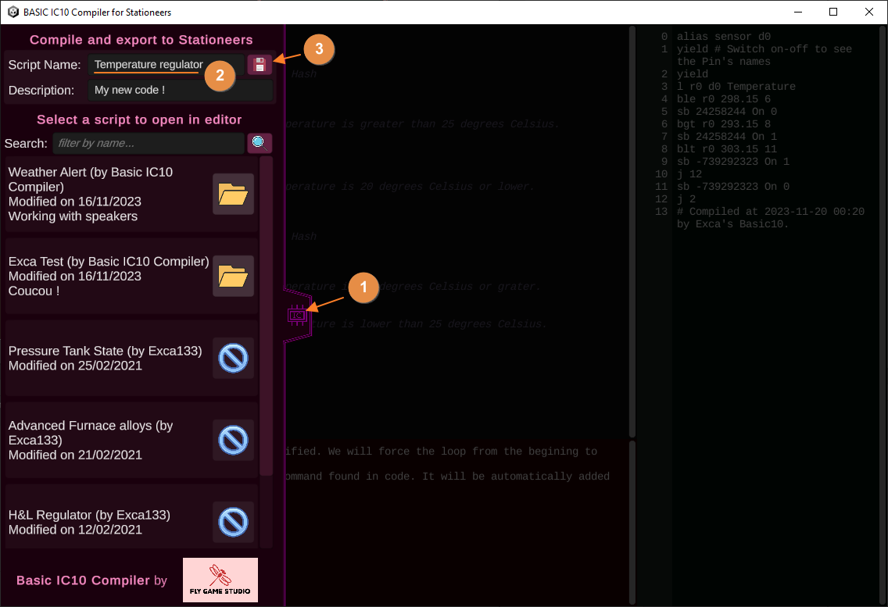

# Guide de Démarrage Rapide

Commencer avec notre compilateur BASIC IC10 pour Stationeers est rapide et simple. Voici un guide rapide pour vous lancer dans la programmation :

1. **Téléchargement et Lancement:**
   - Copiez le dossier de l'application à l'emplacement souhaité (aucune installation n'est nécessaire).
   - Lancez l'application en exécutant `BASIC IC10 Compiler - Stationeers.exe`.


2. **Commencez à Coder:**
   - L'application ouvre une fenêtre redimensionnable avec trois panneaux:
     - *Panneau en haut à gauche* : Votre espace de travail principal pour coder en BASIC.
     - *Panneau de droite* : Il affiche le code IC 10 MIPS généré automatiquement.
     - *Panneau en bas à gauche* : Cette zone est dédiée aux messages d'erreur et d'avertissement si l'application rencontre des problèmes avec votre code.

3. **Flux de Travail de Codage:**
   - Saisissez votre code BASIC directement dans l'application. Vous pouvez également écrire votre code dans votre éditeur de texte préféré, puis le coller dans l'application.
   - Cliquez sur l'icône "IC" pour ouvrir le panneau de gauche. Tapez un nom pour votre programme et enregistrez-le. Il sera ajouté à votre bibliothèque de codes Stationeers.


## Codez directement dans le logiciel


## Enregistrez votre code dans la bibliothèque Stationeers


# Comment coder en Basic

1. **Déclarer une Variable (équivalent à un registre en MIPS)**

    Pour déclarer une variable en BASIC, utilisez le mot-clé `VAR` suivi du nom de la variable. Par exemple :
    ```basic
    VAR temperature
    ```

    [Plus sur les Variables et les déclarations](Basic%20Language%20Reference.md#declarations) (en anglais)

    Cela crée une variable nommée `temperature` qui peut être utilisée pour stocker et manipuler des valeurs.
    ```basic
    VAR temperature
    temperature = 20 C   # 'C' signifie Celsius - la conversion est automatiquement effectuée en Kelvin
    ```
    
    [Plus sur l'assignation de valeurs](Basic%20Language%20Reference.md#set-a-value) (en anglais)

    [Plus sur les Unités comme C, MPa, %, etc.](Basic%20Language%20Reference.md#units) (en anglais)


2. **Lire une valeur depuis un dispositif (équivalent à L en MIPS)**

    Pour lire la température d'un capteur de gaz, utilisez la commande `ALIAS` pour associer le capteur à une variable. Par exemple :
    ```basic
    ALIAS gasSensor Pin0   # Le capteur est placé sur l'entrée 0 de l'IC
    VAR temperature
    temperature = gasSensor.Temperature   # La variable 'Temperature' du dispositif est stockée dans la variable 'temperature'
    ```

    Dans cet exemple, temperature contiendra la valeur de température lue à partir du capteur de gaz sur l'entrée 0 (Pin 0).

    [Plus sur la lecture des dispositifs](Basic%20Language%20Reference.md#devices) (en anglais)


3. **Définir une valeur sur un dispositif (équivalent à S en MIPS)**

    Utilisez la commande `CONST` pour définir une valeur constante, puis utilisez-la dans une instruction de comparaison pour contrôler un chauffage mural. Par exemple :
    ```basic
    ALIAS gasSensor Pin0   # Le capteur est placé sur l'entrée 0 de l'IC
    ALIAS wallHeater Pin1  # et le Chauffage Mural sur l'entrée 1
    
    CONST targetTemperature = 20 C  # La constante sera notre température cible

    wallHeater.On = (gasSensor.Temperature < targetTemperature)   # en une seule ligne de code, nous pouvons lire la température, la comparer, puis utiliser le résultat pour basculer la variable 'On' du chauffage mural à 0 ou 1
    ```

    [Plus sur les valeurs constantes](Basic%20Language%20Reference.md#constants) (en anglais)
    
    [Plus sur les Comparaisons et autres Calculs](Basic%20Language%20Reference.md#calculations) (en anglais)


4. **Structurer un code plus complexe**

    Le langage BASIC peut comprendre des structures plus avancées, comme des structures `if-then-else`, des boucles `while`, etc.
    
    [Plus sur les Structures Conditionnelles](Basic%20Language%20Reference.md#conditional-structures) (en anglais)

    Vous pouvez également utiliser de nombreuses fonctions de calcul pour écrire un code plus lisible.

    ```basic
    # En Basic
    var settingPump = (a + b) * abs(c)  # cette ligne est facile à comprendre
    ```

    ```
    # En MIPS ... pas aussi facile
    alias a r0
    alias b r1
    alias c r2
    alias sumAB r3
    alias absC r4
    alias settingPump r5
    add sumAB a b
    abs absC c
    mul settingPump sumAB absC
    ```

    [Plus sur les Fonctions](Basic%20Language%20Reference.md#functions) (en anglais)

# Documentation du Langage

Pour un guide plus complet sur le langage de programmation BASIC et ses fonctionnalités, consultez notre documentation complète ici : [Documentation en ligne](Basic%20Language%20Reference.md) (en anglais)
