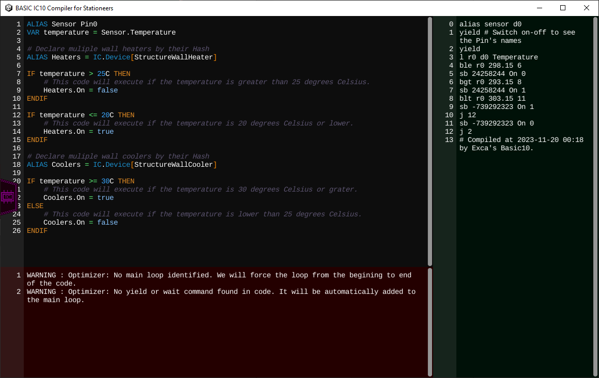

# Stationeers-BASIC-IC10
A BASIC compiler for Stationeers MIPS IC10 code, developed in C#, in Unity, by Exca (Fly Game Studio).

-----

Welcome to our Basic code compiler for Stationeers IC 10 MIPS!

Here are some of the key features of this program:

- **Standalone Application:** Our compiler is a standalone tool, eliminating the need to install additional software or IDEs, making it user-friendly and accessible.

- **Syntax Highlighting:** The compiler provides syntax highlighting, enhancing code readability and reducing errors in your Stationeers Basic scripts.

- **Error Messages:** It offers real-time error messages during compilation, helping you identify and resolve issues in your code promptly.

- **Comprehensive Documentation:** We provide complete documentation for the Basic code format and functions, ensuring you have all the necessary information at your fingertips.

- **Basic Structures:** You can use familiar Basic structures like IF-THEN-ELSE, WHILE loops, and create custom functions to streamline your scripting.

- **Automatic Register Allocation:** Our compiler automatically manages memory registers, eliminating the need to define them manually. It efficiently reuses registers when not allocated, optimizing your code.

- **Stack Usage:** It enables the use of the stack for storing arrays of data, enhancing the versatility of your code.

- **Optimized MIPS Code:** The compiler optimizes MIPS code by minimizing and consolidating lines into single functions when possible, improving efficiency.

- **No Line Loss:** With labels and constant declarations, you won't lose any lines of code. Labels and constants are intelligently replaced in the code, preventing you from reaching the 128-line limit of the IC10 code.

- **Device Addressing:** Easily switch between device addressing methods, whether it's through aliases, batch, or named devices, by changing just one line of code. This feature enhances code adaptability and simplifies device management.

# Where to start?

- [Quick Start Guide](Quick%20Start.md)
- [Basic Language Reference](Basic%20Language%20Reference.md)
